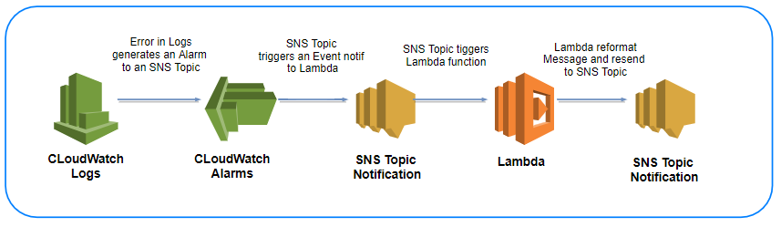

# Cloudwatch Logs Customize alarms


## Introduction

When you get an alarm, you want enough information to decide whether it needs immediate attention or not. You also want to customize the alarm text to operational needs. The **CloudWatch Logs Customize Alarms** is a Lambda function that helps in reading the logs from CloudWatch Logs during an alarm and send a customized message through SNS.

## Flow of Events



## Setup Overview

Lambda function is written in Node.js. We do have a dependency on the latest aws sdk which includes the metrics to logs feature. Hence we create a deployment package. You can create a new Lambda function, and copy the code in index.js from this repository to your function. See 'Configurable parameters' section below.

### Pre-requisite

* CloudWatch Logs has a Log group with a metric filter.
* A CloudWatch Alarm is created to trigger when that metric exceeds a threshold.

### Triggers

* The Lambda function is triggered on a SNS event.
* You need to provide the SNS topic Source.
* You need to provide the SNS topic Destination.

### Authorization

Since there is a need here for various AWS services making calls to each other, appropriate authorization is required.  This takes the form of configuring an IAM role, to which various authorization policies are attached.  This role will be assumed by the Lambda function when running. The below two permissions are required:

1.CloudWatch Logs permits Lambda to call describeMetricFilters and filterLogEvents api. Note that we have given full CloudWatch Logs access, but it is recommended that you only give permissions to call specific api's.

```json
{
  "Version": "2012-10-17",
  "Statement": [
    {
      "Action": [
        "logs:*"
      ],
      "Effect": "Allow",
      "Resource": "*"
    }
  ]
}
```

2.SNS permits Lambda to send a customized messages. Note that we have given push SNS access, but it is recommended that you only give permissions to push message.

```json
{
  "Version": "2012-10-17",
  "Statement": [
    {
      "Effect": "Allow",
      "Action": [
        "sns:Publish"
      ],
      "Resource": "arn::sns:*:${var.aws_account}:${var.vpc_name}-alerts" # terraform format.
    }
  ]
}
```

### Lambda Function

***Configurable parameters:***

1. **Destination** - The SNS destination with messages refactoring needs to be send.
2. **Source** - The SNS source.


***Instructions:***

* Handler: The name of the main code file. In this example, we have used index as the name of the handler.
* When the metric (from the logs metric filters) reaches a threshold an alarm is triggered.
* Once Alarm invokes the SNS topic, Lambda function is invoked and it reads the metricName and metricNamespace from the alarm.
* It then calls describeMetricFilters to get the filterPattern.
* Then Lambda calls filterLogEvents to get the relevant logs.
* SNS used to resend refactored messages.

### Lambda Configuration

This Lambda function was created with runtime Node.js 4.3. It has been tested with 128 MB and 3 seconds timeout. No VPC was used. You can change the configuration based on your testing.

## Getting started

1. Download the zip file located at dist/customize-alarms.
2. Unzip the file. You will see an index.js file and node_modules folder. Index.js is the Lambda function and node_mdoules contain the specific version of AWS SDK.
3. Open index.js in editor of your choice and add the information as specified in the 'Configuration parameters'.
5. Once done with the changes in Lambda, zip the node.js file and node_modules folder.
6. Upload the zip file to the Lambda function.
7. For ease of use, the index.js is also copied in the main directory here.

## Known Limitation

The Lambda function has the following limitation:
* The nextToken in filterLogEvents api call is ignored. For production use, the lambda function should be modified to query filterLogEvents again with the nextToken received from the previous call. We need to continue querying until we get a null nextToken. More information on the api can be found [here](http://docs.aws.amazon.com/AmazonCloudWatchLogs/latest/APIReference/API_FilterLogEvents.html).

## License Summary

This sample code is made available under the MIT license.
